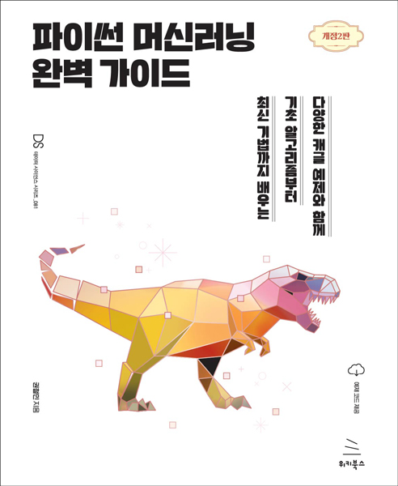

# 파이썬 머신러닝 완벽 가이드(개정2판)
### 다양한 캐글 예제와 함께 기초 알고리즘부터 최신 기법까지 배우는

- 권철민 지음
- 40,000원 | 2022년 4월 21일 발행 | 724쪽
- [책 홈페이지](https://wikibook.co.kr/pymlrev2/)
- [도서 미리보기](http://www.yes24.com/Product/Viewer/Preview/108824557)
- [도서 관련 문의](https://wikibook.co.kr/support/contact/)

---

**자세한 이론 설명과 파이썬 실습을 통해 머신러닝을 완벽하게 배울 수 있습니다!**

《파이썬 머신러닝 완벽 가이드》는 이론 위주의 머신러닝 책에서 탈피해, 다양한 실전 예제를 직접 구현해 보면서 머신러닝을 체득할 수 있도록 만들었습니다. 캐글과 UCI 머신러닝 리포지토리에서 난이도가 있는 실습 데이터를 기반으로 실전 예제를 구성했고, XGBoost, LightGBM, 스태킹 기법 등 캐글의 많은 데이터 사이언스에서 애용하는 최신 알고리즘과 기법을 상세하게 설명했습니다.

이번 개정2판에서는 최신 사이킷런 버전(1.0.2)을 포함해 책에서 사용되는 모든 라이브러리를 최신 버전으로 업그레이드한 실습 코드를 구현하고, 다양한 유형의 하이퍼파라미터를 가지는 XGBoost나 LightGBM 모델의 최적 하이퍼파라미터 튜닝을 위한 베이지안 최적화 기법 적용 실습을 제공합니다. 또한 머신러닝 관련 데이터 분석에 널리 쓰이는 시각화 라이브러리인 matplotlib과 seaborn의 활용법을 다룬 장을 새롭게 추가했습니다.

---
 
 ## 구입처
 
 - [예스24](http://www.yes24.com/Product/Goods/108824557)
 - [교보문고](https://product.kyobobook.co.kr/detail/S000001766511)
 - [인터파크](http://book.interpark.com/product/BookDisplay.do?_method=detail&sc.prdNo=354679508)
 - [알라딘](https://www.aladin.co.kr/shop/wproduct.aspx?ItemId=292601583)

---

## 실습 데이터 다운로드 페이지

- 2장
    - 타이타닉 탑승자: <https://www.kaggle.com/c/titanic/data>
- 3장
    - 피마 인디언 당뇨병 예측: <https://www.kaggle.com/datasets/uciml/pima-indians-diabetes-database>
- 4장
    - 사용자 행동 인식 데이터 세트: <http://archive.ics.uci.edu/ml/datasets/Human+Activity+Recognition+Using+Smartphones>
    - 산탄데르 고객 만족 예측: <https://www.kaggle.com/competitions/santander-customer-satisfaction/data>
    - 신용카드 사기 검출: <https://www.kaggle.com/datasets/mlg-ulb/creditcardfraud>
- 5장
    - 자전거 대여 수요 예측: <https://www.kaggle.com/competitions/bike-sharing-demand/data>
    - 주택 가격: <https://www.kaggle.com/competitions/house-prices-advanced-regression-techniques/data>
- 6장
    - 신용카드 고객 데이터 세트: <https://archive.ics.uci.edu/ml/datasets/default+of+credit+card+clients>
- 7장
    - 온라인 소매점 데이터 세트: <http://archive.ics.uci.edu/ml/datasets/online+retail>
- 8장
    - IMDB 영화평: <https://www.kaggle.com/competitions/word2vec-nlp-tutorial/data>
    - Opinion Review 데이터 세트: <https://archive.ics.uci.edu/ml/datasets/Opinosis+Opinion+%26frasl%3B+Review>
    - Mercari Price Suggestion Challenge: <https://www.kaggle.com/competitions/mercari-price-suggestion-challenge/data>
- 9장
    - TMDB 5000 영화 데이터 세트: <https://www.kaggle.com/datasets/tmdb/tmdb-movie-metadata>
    - MovieLens 데이터 세트: <https://grouplens.org/datasets/movielens/latest/>
